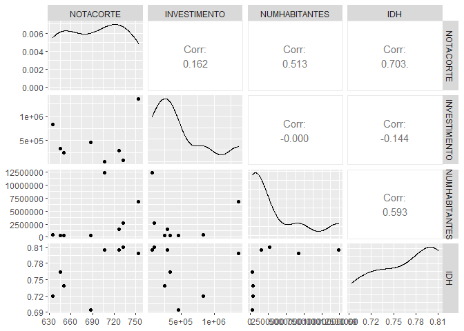
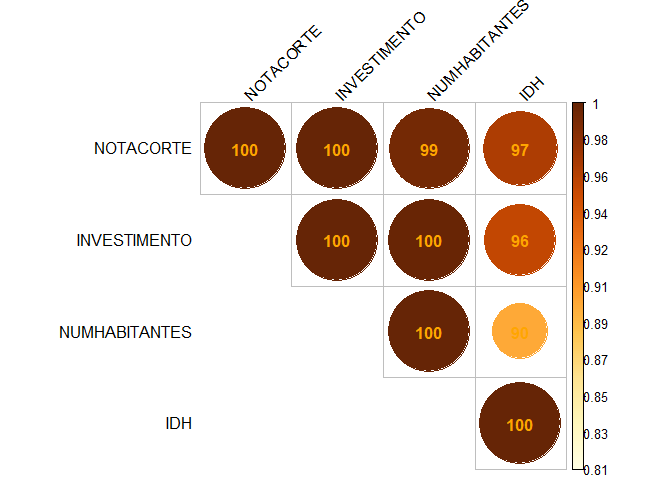
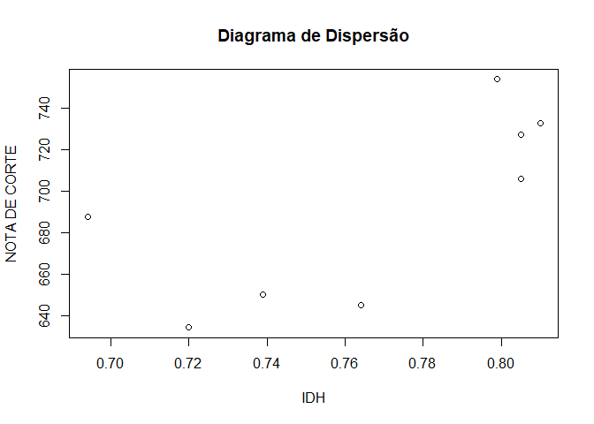

# - Introdução

Nesta seção, estudamos a relação entre diferentes variáveis aplicadas à ciência de dados no R. Neste trabalho, investiguei a relação entre notas de corte para acesso ao curso de administração através do SiSU, investimentos educacionais, população e IDH. Foram coletadas 8 amostras através de dados públicos disponíveis na plataforma do SiSU, portal da transparência e IBGE.

# - Objetivo

A principal motivação é estudar se há relação direta entre dados das localidades e a concorrência para o curso de administração através do SiSU.

# - Descrição das Variáveis

## - Fonte
Os dados coletados foram obtidos através das seguintes fontes:
* https://sisu.mec.gov.br/#/relatorio#onepage
* https://cidades.ibge.gov.br
* https://www.portaltransparencia.gov.br/funcoes/12-educacao?ano=2020

## - Preparação do ambiente
A partir daqui, iremos analisar a relação entre as variáveis. Inicialmente, vamos preparar o ambiente.


```r
# Define o diretório de trabalho
#setwd("~Documents/Erich/GitHub/MAF_172") 

# Instalando dependências
library(pacman)
p_load(char=c("DescTools","readxl","janitor", "psych", "corrr", "ggplot2", "dplyr", "caret", "corrplot","spatstat", "maptools", "gstat", "foreign", "geoR","moments","scatterplot3d","tcltk2", "sp", "rgdal", "raster", "doParallel", "GGally"))
```

## - Leitura dos dados
Faremos então a leitura dos dados que estão armazenados em um arquivo de texto (.txt).


```r
# Importando os dados
dados = read.table("../dados_prova.txt", head=T)
str(dados)
```

```
## 'data.frame':	8 obs. of  5 variables:
##  $ NOTACORTE    : num  754 706 733 727 688 ...
##  $ INVESTIMENTO : int  1360782 65865 90000 293600 459714 337270 248592 835479
##  $ NUMHABITANTES: int  6775561 12330000 2722000 1492530 278264 261501 343132 402912
##  $ IDH          : num  0.799 0.805 0.81 0.805 0.694 0.764 0.739 0.72
##  $ CIDADE       : chr  "Rio de Janeiro" "São Paulo" "Belo Horizonte" "Porto Alegre" ...
```

```r
# Leitura dos dados importados
dados.rls = dados[1:4]
names(dados.rls)
```

```
## [1] "NOTACORTE"     "INVESTIMENTO"  "NUMHABITANTES" "IDH"
```


## - Processamento dos dados

Vamos agora processar os dados obtidos de três formas, sendo duas delas através de correlação de matriz linear e a outra como correlação não linear.

### - Matriz de correlação linear

```r
# Processamento em paralelo
cl <- makePSOCKcluster(4)
registerDoParallel(cl)
# Aqui começa o procedimento
df2 <- cor(dados.rls, use = "na.or.complete")
corrplot(df2, order="alphabet", method="circle", tl.pos="td", type="upper", 
         tl.col="black", tl.cex=0.9, tl.srt=45, 
         addCoef.col="orange", addCoefasPercent = TRUE, diag = TRUE,
         sig.level=0.995, p.mat = 1-abs(df2),insig = "blank")
```

<!-- -->

```r
# Aqui termina o procedimento
stopCluster(cl)
```

Nessa análise, pudemos observar que a maior relação linear encontrada se dá entre a nota de corte e o IDH.

### - Outra Matriz de correlação linear


```r
# Outra Matriz de Correlacao

cl <- makePSOCKcluster(4); registerDoParallel(cl)
# Aqui começa o procedimento
ggpairs(dados.rls)
```

<!-- -->

```r
# Aqui termina o procedimento
stopCluster(cl)
```

Através dessa matriz, podemos ver como os dados se relacionam e o grau de correlação.

### - Matriz de correlação não linear


```r
par(mfrow=c(1,1))
par(mar=c(8,4,6,4))
# Processamento em paralelo
cl <- makePSOCKcluster(4)
registerDoParallel(cl)
# Aqui começa o procedimento
# Função de Lopez-Paz (2013)
rdc <- function(x,y,k=20,s=1/6,f=sin) {
  set.seed(313)
  x <- cbind(apply(as.matrix(x),2,function(u)rank(u)/length(u)),1)
  y <- cbind(apply(as.matrix(y),2,function(u)rank(u)/length(u)),1)
  x <- s/ncol(x)*x%*%matrix(rnorm(ncol(x)*k),ncol(x))
  y <- s/ncol(y)*y%*%matrix(rnorm(ncol(y)*k),ncol(y))
  cancor(cbind(f(x),1),cbind(f(y),1))$cor[1]
}
# Tabela é o data.frame
tabela = dados.rls
correl_nao_linear <- function (tabela) {
  c = c("peraser")
  mcnl = matrix(nrow = ncol(tabela), ncol = ncol(tabela))  
  for (i in 1:ncol(tabela)) {
    for (j in 1:ncol(tabela)) {
      mcnl[i,j] = rdc(tabela[,i],tabela[,j])
    }
  }
  mcnl =as.data.frame(mcnl)
  colnames(mcnl) = colnames(tabela)
  rownames(mcnl) = colnames(tabela)
  return(mcnl)
}
par(mfrow=c(1,1))
cornl = correl_nao_linear(tabela)
corrplot(as.matrix(cornl),is.corr = F, method="circle", tl.srt=45,
         tl.pos="lt", type="upper",tl.col="black", addCoefasPercent = TRUE,
         sig.level=0.995, addCoef.col="orange")
```

<!-- -->

```r
# Aqui termina o procedimento
stopCluster(cl)
```

Através dessa análise podemos concluir que as variáveis observadas possuem alto grau de correlação não linear, sendo as maiores delas a nota de corte com relação ao investimento e o investimento com relação ao número de habitantes.

# - Regressão Linear Simples

Nesta seção, faremos uma simples regressão linear entre as variáveis IDH e NOTADECORTE. Foram escolhidas essas variáveis pois são as que possuem maior índice de correlação linear.

O código abaixo realiza o diagrama de dispersão dos referidos dados.


```r
resp = dados.rls$NOTACORTE
explic = dados.rls$IDH
# Gerando o gráfico
par(mfrow=c(1,1))
plot(explic, resp, main="Diagrama de Dispersão", 
     xlab = "IDH", ylab = "NOTA DE CORTE") 
```

<!-- -->

Com o código abaixo, faremos uma estimativa da função linear que melhor se adequa aos dados. 


```r
(rls = lm(resp~explic))
```

```
## 
## Call:
## lm(formula = resp ~ explic)
## 
## Coefficients:
## (Intercept)       explic  
##       151.9        704.4
```

Obtivemos portanto uma função do tipo $f(x) = 704.4x + 151.9$. Sendo $151.9$ a intersecção da reta com o eixo das ordenadas e $704.4$ a taxa de variação, ou seja, a cada aumento de $0.1$ no IDH, a nota de corte cresce, em média, $70.44$.

O código abaixo mostrará a reta definida pela função acima plotada no gráfico de dispersão.


```r
par(mar=c(6,4,4,4))
plot(explic, resp)
abline(rls)
text(3,90,expression("f(x) = 704.4x + 151.9"))
```

<!-- -->

A reta não intercepta perfeitamente os pontos, entretanto é uma aproximação razoável para descrever as notas de corte em função do IDH.
